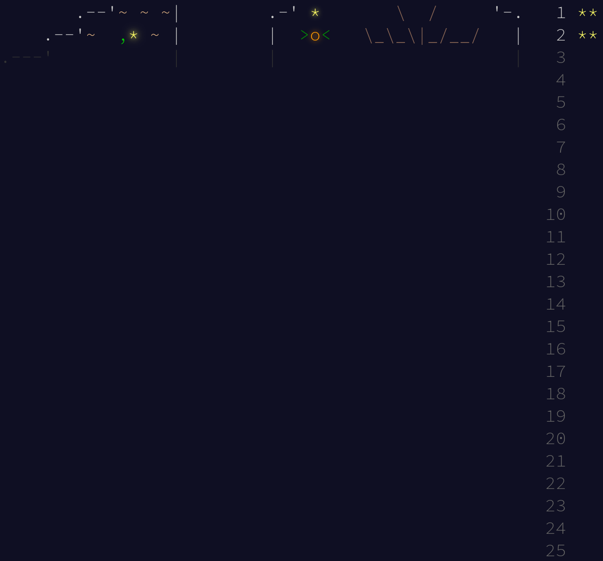

# Advent of Code 2024 in C++

My happiness levels for each solution from 1-5: &nbsp; 🤨 😐 🙂 😀 😄

|                                              | Part 1 Solution                                                                 | Part 2 Solution                                                               | Input                           |
|:---------------------------------------------|:--------------------------------------------------------------------------------|:------------------------------------------------------------------------------|:--------------------------------|
| [Day 01](https://adventofcode.com/2024/day/1) | [part1.cpp](Day%2001/part1.cpp) - [0.253929ms](Day%2001/output_part1.txt) - 😄 | [part2.cpp](Day%2001/part2.cpp) - [0.338325ms](Day%2001/output_part2.txt) - 😄 | [input.txt](Day%2001/input.txt) |
| [Day 02](https://adventofcode.com/2024/day/2) | [part1.cpp](Day%2002/part1.cpp) - [0.272486ms](Day%2002/output_part1.txt) - 😄 | [part2.cpp](Day%2002/part2.cpp) - [0.445645ms](Day%2002/output_part2.txt) - 😀 | [input.txt](Day%2002/input.txt) |
| [Day 03](https://adventofcode.com/2024/day/3) | [part1.cpp](Day%2003/part1.cpp) - [0.342503ms](Day%2003/output_part1.txt) - 😄 | [part2.cpp](Day%2003/part2.cpp) - [1.83294ms](Day%2003/output_part2.txt) - 😀 | [input.txt](Day%2003/input.txt) |

&nbsp;



## How to run

### cmake

Run the following commands to build the executables:

```bash
mkdir build
cd build
cmake -DCMAKE_BUILD_TYPE=Release ..
make
```

Then, run them with:

```bash
./Part1
```

or

```bash
./Part2
```

### For VsCode users

- Install the CMake extensions
- Open the Day xx folder in VsCode
- Run `CMake: Configure` if it's not already configured
- You can set the target (part1 or part2) with `CMake: Set Launch/Debug Target`
- If you want to switch between Debug and Release mode, run `CMake: Select Variant`
- Press `Shift+F5` to run

## Notes

Each Day xx folder consists of the following files:
- `part1.cpp`: The code for the first part
- `part2.cpp`: The code for the second part
- `output_part1.txt`: The output for the first part
- `output_part2.txt`: The output for the second part
- `sample_input.txt`: The sample input given in the task description
- `input.txt`: The input I received
- `CMakeLists.txt`: The CMake build instructions

There is also a `Lib` folder at the root of the repository with utility functions like `ReadFile()` and `AverageTime()` for timing.

Note that I'm using `std::chrono::high_resolution_clock`, which, despite it's name, is not very accurate (it usually just uses the system clock, but it depends on the implementation).
It's also going to vary due to interrupts and task switches.
For the first couple of days where the execution time is < 1ms, the timer isn't that useful. However, I still think it's going to be a nice estimate for the later days.
